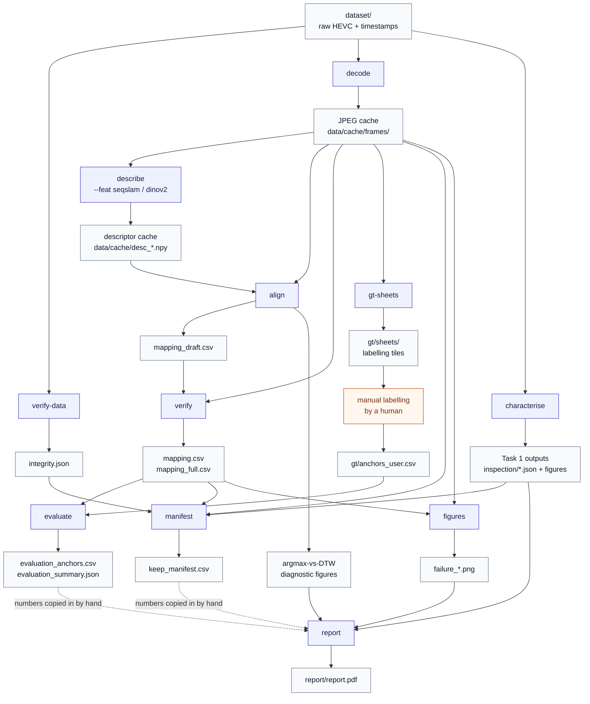

# Route alignment: runA → runB

Phase-2 take-home for an autonomous-driving software company. Two dashcam recordings of the same
route, made on different days (`runA`, `runB`), each with two side-facing cameras (`cam0` =
kerb side, `cam5` = road side). Three deliverables, in `report/report.pdf`:

1. **Characterise** the recordings — frame count, resolution, frame rate, route time, interval
   irregularities — separating what was *measured* from what a tool merely *declared*.
2. **Match frames** runA → runB: a frame-level correspondence (`outputs/mapping.csv`) with a
   confidence per frame and an honest, ground-truth-backed accuracy estimate.
3. **Recommend a keep/discard policy** for model training/testing (`outputs/keep_manifest.csv`).

## Environment

```bash
conda create -n phase2-vpr python=3.11 -y
conda activate phase2-vpr
pip install -r requirements.txt
```

Video I/O goes through the `ffmpeg`/`ffprobe` **CLI binaries** via `subprocess`, never a Python
binding — PyAV alongside `opencv-python` bundles a second, differently-versioned copy of the
ffmpeg shared libs, producing a macOS ObjC `libavdevice` class-duplication conflict. Install
ffmpeg separately (e.g. `brew install ffmpeg`) if it isn't already on `PATH`.

Versions this codebase was built and last verified against:

| | version |
|---|---|
| Python | 3.11.16 |
| ffmpeg | 8.1.1 (`ffmpeg version 8.1.1`, Apple clang 21.0.0, `--enable-videotoolbox --enable-neon`) |
| numpy | 2.4.6 |
| scipy | 1.17.1 |
| pandas | 3.0.5 |
| opencv-python | 5.0.0 |
| matplotlib | 3.11.1 |
| torch / torchvision | 2.13.0 / 0.28.0 (DINOv2 descriptor; `mps` backend used on Apple Silicon) |
| pytest | 9.1.1 |
| ruff | 0.16.5 |

`requirements.txt` pins packages, not exact versions (the table above is what `pip` actually
resolved on this machine) — re-running `pip install -r requirements.txt` on a different date may
resolve newer ones; re-verify this table if numbers stop reproducing.

## Pipeline

Each box below is one `python -m routealign <subcommand>` call and one Makefile target
(`make <subcommand>`). An arrow means "genuinely reads this as input" (verified against the code,
not assumed from the Makefile's listed order) -- two stages with no arrow between them, like
`verify-data` and `decode`, are independent and could run in either order; the Makefile still
runs them in a fixed order for its own reasons (see below), it's just not a data dependency.
Orange is the one manual, non-automated step; dashed arrows are also manual (a human reads the
file and copies numbers into `report.tex` by hand -- editing the file does not regenerate the PDF).



`make all` still runs `verify-data` before `decode` (and `characterise` after both, and
`gt-sheets` after `align`/`verify`) even though none of those pairs need each other's output --
deliberate ordering, not a data dependency: fail fast on a corrupt file before spending time
decoding or characterising it, and keep the model-blind labelling sheets generated late enough
that they are obviously not influenced by having looked at the pipeline's own predictions first.

`describe`/`align`/`verify` run once per descriptor (SeqSLAM, DINOv2) and are fused inside
`align`/`verify` into one joint similarity before the DTW search — SeqSLAM alone is cheap but
collapses under rain/low-texture stretches, DINOv2 alone has no classical baseline to
cross-check against, so both run together rather than choosing one. `align` also writes the
argmax-vs-DTW diagnostic figures from that same joint similarity, so the images and the ablation
numbers quoted in the report are never computed from two different things.

**The one manual step**: `gt-sheets` generates model-blind browsing sheets (`gt/sheets/`, not
committed — regenerate with the command below); a human then looks at them and fills in
`gt/anchors_user.csv` by hand, per `gt/labelling_protocol.md`'s "same place" definition. `evaluate`
cannot run meaningfully before this step exists.

## Reproduce from a clean cache

```bash
conda activate phase2-vpr
make verify-data                    # 8/8 SHA-256 vs dataset/SHA256SUMS.txt
make decode                         # ~4s/stream; writes data/cache/frames/
make characterise                   # Task 1 → outputs/inspection/*.json, figures, task1_table.md
make describe FEAT=seqslam
make describe FEAT=dinov2           # needs torch.hub network access on first run
make align                          # → outputs/mapping_draft.csv
make verify                         # → outputs/mapping.csv, mapping_full.csv (2695 rows)
make gt-sheets                      # → gt/sheets/ (git-ignored, ~113MB)
#   ... label gt/anchors_user.csv by hand here, or use the one already in the repo ...
make evaluate                       # → outputs/evaluation_anchors.csv, evaluation_summary.json
make manifest                       # → outputs/keep_manifest.csv (10716 rows)
make figures                        # → outputs/inspection/figures/failure_*.png
make report                         # → report/report.pdf
```

or simply `make all` (skips nothing except the manual labelling step, which reuses whatever
`gt/anchors_user.csv` is already committed). `--limit N` on any subcommand caps it to the first
`N` frames for a fast smoke run, e.g. `python -m routealign --config config.yaml align --limit 60`.

Determinism: `make all` twice must produce byte-identical CSVs (fixed seeds, sorted iteration, no
wall-clock values in outputs — CLAUDE.md §4).

## Tests and lint

```bash
make test   # pytest -q -- 107 tests, synthetic fixtures, < 2s
make lint   # ruff format --check . && ruff check .
```

## The H0 assumption

Every output keys frames by **H0**: timestamp line `k` = decoded frame `k` of each camera, for
`k < decoded_count(run, cam)`. This is a **documented assumption, not a measured fact** — no
hardware timestamp cross-check exists in this dataset. It is backed by structural evidence (GOP/IDR
positions match exactly across all 4 streams for effectively their whole usable range), not merely
assumed by default. `decoded_count` differs from the timestamp-file
line count in every file (runA: 2695 lines / 2674 decoded; runB: 2663 lines / 2622 (`cam0`) or
2615 (`cam5`) decoded) — the difference is treated as `status=no_frame`, never silently coerced
into a match.

## Layout

See `CLAUDE.md` §2 for the full annotated layout. In short: `src/routealign/` is the package (one
module per responsibility, dependency direction enforced one-way — `CLAUDE.md` §3); `dataset/` is
read-only raw input; `data/cache/` and `outputs/*.npy` are generated and git-ignored; everything
else under `outputs/` (CSVs, JSON, figures) is a real, regeneratable artifact, schema documented in
`outputs/SCHEMA.md`.
